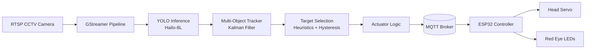
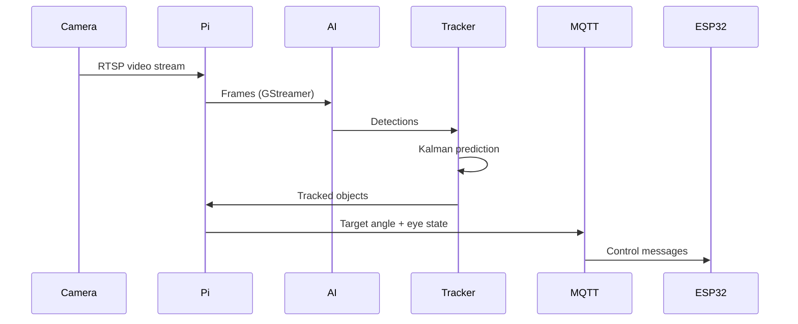

# JebCam – AI-Driven Animatronic Skeleton

An AI-powered Halloween animatronic that uses real-time computer vision to detect people and turn a skeleton’s head to follow them as they walk past.

This project combines a Raspberry Pi 5 with a Hailo-8L AI accelerator, a CCTV camera feed, and a servo-driven skeleton head controlled wirelessly via MQTT. The result is a responsive, attention-grabbing decoration that reacts autonomously to its environment.

---

## Project Overview

For Halloween, the goal was to create an animatronic decoration that reacted intelligently to people in the real world, rather than following a pre-programmed motion loop. Since a CCTV camera already covered the front of the house, the idea was to reuse that video feed, apply real-time AI inference, and physically actuate a skeleton’s head so that it tracked passers-by.

The project also served as a first practical experiment with a Hailo-8L–based AI accelerator on a Raspberry Pi 5.

At night, red LED eyes enhance the effect, giving clear visual feedback that the skeleton is “aware” of movement.

---

## Demo (Photos & Videos)

> Replace the placeholders below with actual image/video links once added to the repository.

### Skeleton & Mechanical Work

- **Unboxing the skeleton**  
  

- **Original ball-and-socket neck joint**  
  

- **3D-printed replacement joint with servo**  
  

- **Electronics assembly (ESP32, servo, LEDs)**  
  

- **Skull with red LEDs illuminated**  
  

- **Electronics installed inside the skull**  
  

### Compute & AI Hardware

- **Raspberry Pi 5 with Hailo-8L accelerator**  
  

### Videos

- **Direct MQTT servo/LED control test**  
  `media/videos/mqtt_direct_control.mp4`

- **Replay-mode test (offline video source)**  
  `media/videos/replay_test.mp4`

- **Full system test (daylight, phone camera)**  
  `media/videos/daylight_phone_test.mp4`

- **Matching CCTV view with AI annotations**  
  `media/videos/cctv_ai_overlay.mp4`

- **Night-time operation**  
  `media/videos/night_test.mp4`

---

## System Architecture

The system is split into three main parts:

1. **Vision & AI inference** (Raspberry Pi + Hailo)
2. **Decision-making & tracking** (Python application)
3. **Physical actuation** (ESP32 + servo + LEDs)

## Hardware

- **Skeleton:**  
  Cheap plastic hanging skeleton (Argos)  
  https://argos-support.co.uk/1239533-argos-home-large-hanging-skeleton

- **Compute:**  
  - Raspberry Pi 5  
  - Hailo-8L AI accelerator

- **Camera:**  
  - Existing CCTV camera providing RTSP stream

- **Actuation & Control:**  
  - ESP32 (Wi-Fi, MQTT client)  
  - Metal-gear 270° servo (head rotation)  
  - Red LEDs (eyes)  
  - 5V USB power supply

- **Mechanical:**  
  - Custom 3D-printed neck joint (designed in Autodesk Fusion 360)

---

## Mechanical Design

The original skeleton head uses a simple ball-and-socket joint with no provision for actuation. To motorise it:

1. The skull was disassembled and the original joint removed.
2. The ball and socket geometry were measured accurately.
3. A replacement joint was modelled in Autodesk Fusion 360 to:
   - Preserve the original external geometry  
   - House a servo inside the skull
4. An initial 180-degree plastic-gear servo was tested but failed due to gear wear, causing stuttering and shaking.
5. This was replaced with a metal-gear 270-degree servo, which provided smoother motion and improved durability.

The final design allows controlled left/right head rotation while remaining visually discreet.

---

## Software Overview

### Raspberry Pi (Vision & Control)

- **Language:** Python  
- **Video ingestion:** GStreamer (required for the Hailo pipeline)  
- **Inference:** YOLO running on the Hailo-8L accelerator  
- **Detected classes:** `person`, `dog`

The Raspberry Pi subscribes to the CCTV RTSP stream and feeds frames into a GStreamer pipeline compatible with the Hailo device. Detections are produced by the YOLO model and passed into a multi-object tracking system.

### Tracking & Target Selection

- Stable tracks are created for detections.
- Kalman filtering predicts object positions to compensate for inference latency.
- Pixel coordinates are converted to real-world coordinates using simple geometry based on the known position of the skeleton’s base.
- Each tracked object is assigned a weight based on:
  - Apparent size  
  - Distance  
  - Track age
- The highest-weighted target is selected.
- Hysteresis is applied to prevent rapid target switching.

The selected target is passed to an actuator module, which computes the required servo angle and publishes commands via MQTT.

---

## Replay & Debug Features

The GStreamer pipeline supports additional debug functionality:

- Optional encoding of annotated output video
- Snapshot capture when new tracks are first detected
- **Replay mode**, where video is sourced from a recording instead of a live RTSP stream

Replay mode was essential for development, integration, and debugging, allowing consistent testing without requiring live activity in front of the camera.

---

## ESP32 Controller

- **Connectivity:** Wi-Fi  
- **Protocol:** MQTT  

The ESP32 subscribes to control topics published by the Raspberry Pi and translates them into physical actions.

### Subscribed Topics

- Head angle (degrees)
- Eye LED on/off state (boolean)

### Published Topics

- Heartbeat signal at 1 Hz for liveliness monitoring

The ESP32 directly drives the servo and LEDs, providing a clean separation between AI logic and hardware control.

---

## Media & Documentation

The following media assets should be embedded throughout this document:

### Photos

- Unboxing the skeleton  
- Original ball-and-socket joint  
- 3D-printed replacement joint with servo  
- Electronics assembly (ESP32, servo, LEDs)  
- Skull with red LEDs illuminated  
- Electronics installed inside the skull  
- Raspberry Pi with Hailo-8L accelerator  

### Videos

- Direct MQTT control test (servo + LEDs)  
- Replay-mode test driving the skull  
- Full system test in daylight (phone camera)  
- Matching CCTV view with AI annotations  
- Night-time operation video  

---

## Results

- The skeleton was installed for approximately two weeks before Halloween.
- Many passers-by noticed the head-tracking behaviour and reacted with surprise or amusement.
- The red LED eyes significantly enhanced the effect at night.
- Replay-based development greatly reduced iteration time and simplified debugging.

---

## Future Improvements

- Add a second axis for vertical head movement
- Improve motion smoothing and acceleration profiles
- Gesture-based or proximity-based reactions
- Audio output for sound effects
- Context-aware behaviour (day/night, weather)

---

## YouTube Short

A short-form video accompanies this project, focusing on:

- Immediate visual impact  
- Clear AI-driven behaviour  
- Real-world interaction  

Link to be added.

---

## License

See the `LICENSE` file for details.
